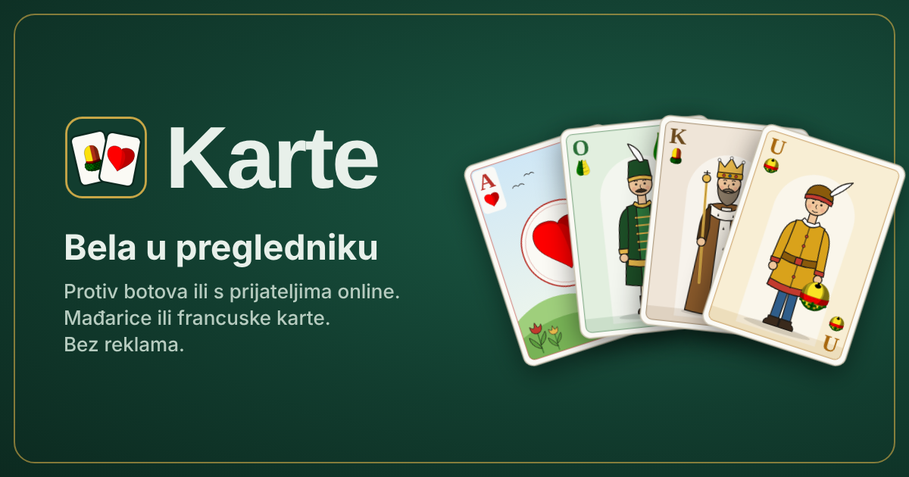

# Karte brand

**Karte** is the site; **Bela** is its first game. The voice is plain, friendly Croatian (English second):
short sentences, the real bela vocabulary (adut, zvanje, štih, pad, visi, štiglja), no exclamation-mark hype.

## Mark and wordmark



- **Mark:** two fanned cards on table felt with a gold rim. The back card shows the acorn (žir), the front
  card the heart (srce), both from the Hungarian deck. Files: `public/favicon.svg` (also used in the UI by
  `src/ui/Logo.tsx`), PNG icons in `public/icons/`.
- **Wordmark:** "Karte" in Bricolage Grotesque 800, tight tracking, next to the mark.
- Keep clear space of at least a quarter of the mark's width around it. Don't recolour the cards or the felt.

## Colours

| Token | Value | Use |
|---|---|---|
| felt-deep | `#0C2A20` | app ground, bars, icon background edge |
| felt | `#123D2F` | table, mark tile |
| gold | `#E7B84B` | primary actions, mark rim, card-back lattice |
| card | `#FBFAF5` | card faces |
| card-back | `#8F1D2C` | card backs |
| suit-red | `#C23A2E` | hearts, errors |

Full UI tokens are in `docs/design/bela-concept/README.md` and the `bela` theme in `src/styles.css`.

## Type

Bricolage Grotesque 600/800 for the wordmark, titles and big numbers; DM Sans 400/500/700 for everything else.

## Icons

Navigation icons are drawn in `src/ui/icons.tsx` (24x24 grid, 2px round strokes, `currentColor`). Every page
has a home button in the navbar; phones also get a bottom bar with Početna, Online, Pravila and Povijest.

## Generated assets

```bash
node scripts/cards/build-brand.mjs   # favicon.svg, icons/*.png, og-image.png in public/
```

`index.html` carries the description, Open Graph and Twitter tags (absolute URLs for the share image) and
links `public/manifest.webmanifest`, so the site can be added to a phone's home screen as "Karte".

## Croatian copy conventions

- **Ruka** is one deal (hand), **partija** is a whole match to 1001. "Kraj ruke", not "Kraj partije".
- **Zvač** is the player or pair that called trump. Write "zvač: Ana" rather than "zvao Ana": the
  participle would assume a gender.
- Address the player as "ti". Avoid gendered past participles about the player or others ("spreman",
  "odspojen", "blokirao si"); rephrase ("Jedna partija bele?", "bez veze", "igrači koje blokiraš").
- Hungarian deck names: **srce, bundeva, žir, zelje**; **unter (U), ober (O), kralj (K), as (A)**.
  The deck itself is **mađarice**; the other one is **francuske** (karte).
- Every string lives in `src/i18n/strings.ts` in both languages. Sentences with names or numbers use
  `{placeholders}` filled by `fmt()`, never concatenation.
