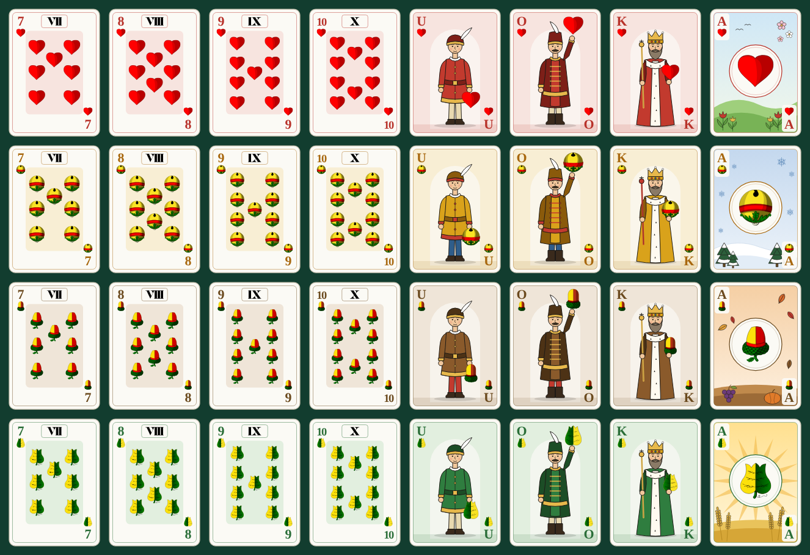

# Hungarian deck (mađarice)

The 32-card Hungarian-pattern deck the app shows by default: 7–10, Unter (U), Ober (O), King (K) and Ace (A)
in hearts (srce), bells (bundeva), acorns (žir) and leaves (zelje).



| Cards | Design |
|---|---|
| VII–X | Suit pips in two columns with the Roman numeral in a cartouche at the top |
| Aces | The four seasons, as on traditional Hungarian cards: hearts spring, leaves summer, acorns autumn, bells winter |
| U, O, K | Original figures: the Unter holds his suit low, the Ober raises it high, the King holds it beside his sceptre |

Every card has an upright index (rank and suit) top left and bottom right, so it reads in a fanned hand.
The figures and pips are not mirrored, as on real Hungarian cards, so the bottom index is upright too.

## Files

| Where | What |
|---|---|
| `src/ui/decks/hungarian/cards/<suit>-<rank>.svg` | The cards as the app loads them (600x840 viewBox) |
| `src/ui/decks/hungarian/emblems/<suit>.svg` | Small suit marks used in text: trump tile, trump buttons, hand summary |
| `docs/design/hungarian-deck/png/<suit>-<rank>.png` | 600x840 PNG exports with transparent corners |
| `docs/design/hungarian-deck/deck.png` | All 32 cards on one sheet |

Suits are `hearts`, `bells`, `acorns`, `leaves`; ranks are `7`, `8`, `9`, `10`, `unter`, `ober`, `king`, `ace`.
The engine keeps French suit ids: hearts = hearts, diamonds = bells, clubs = acorns, spades = leaves.

## Regenerating

```bash
node scripts/cards/build-hungarian-deck.mjs        # SVGs only
node scripts/cards/build-hungarian-deck.mjs --png  # SVGs, PNGs and the deck sheet (uses Playwright's Chromium)
```

All drawing lives in that script. Do not edit the SVG files by hand: `src/ui/decks/decks.test.tsx` fails
when the committed files differ from what the script generates.

## Artwork source and licence

Suit symbols and Roman numerals come from **Hungarian cards symbols** by Gabor (razr), an Inkscape symbol
set marked **public domain**: <https://inkscape.org/~razr/%E2%98%85hungarian-cards-symbols>.
`scripts/cards/extract-symbols.mjs` pulls the 12 symbols we use into `scripts/cards/symbols/` (cleaned and
rounded, 0.5–10 KB each); the full 1.9 MB sheet is not committed. To re-extract:

```bash
node scripts/cards/extract-symbols.mjs "path/to/Hungarian cards symbols.svg"
```

The season scenes, court figures, layout and indices are original to this project.
